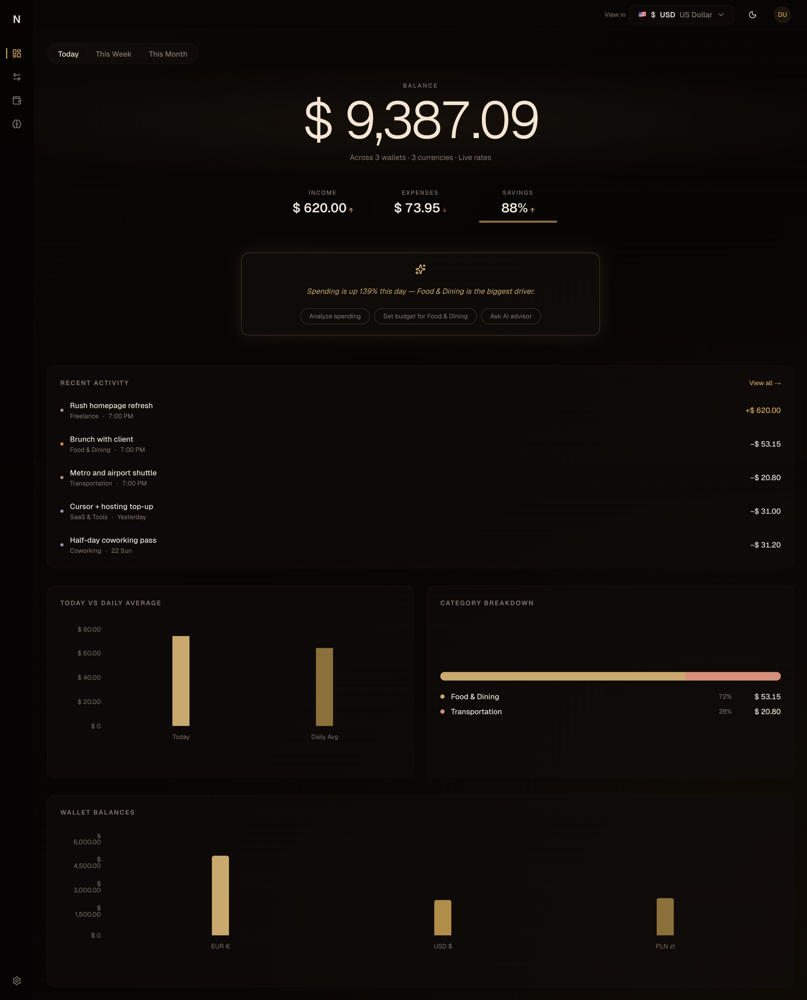
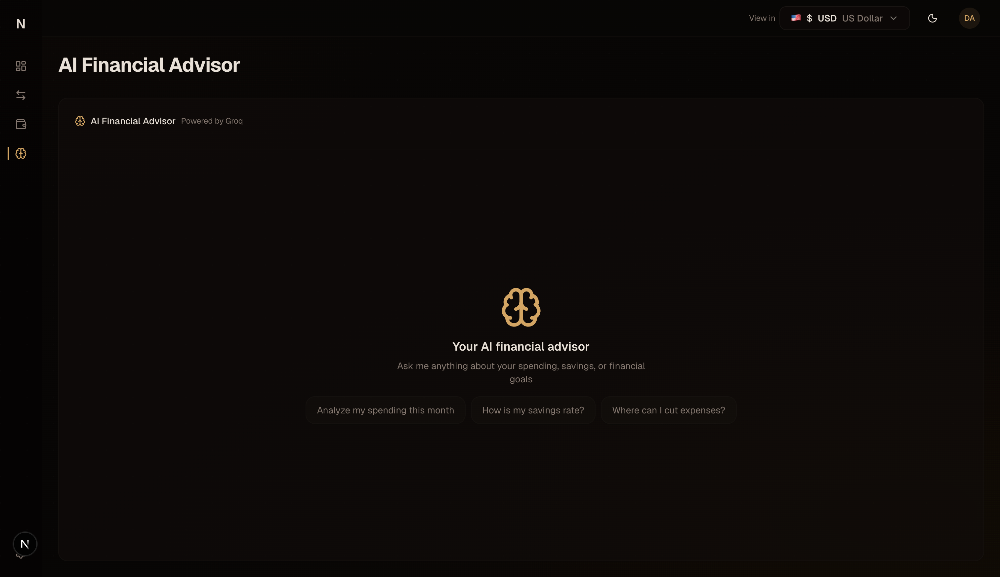
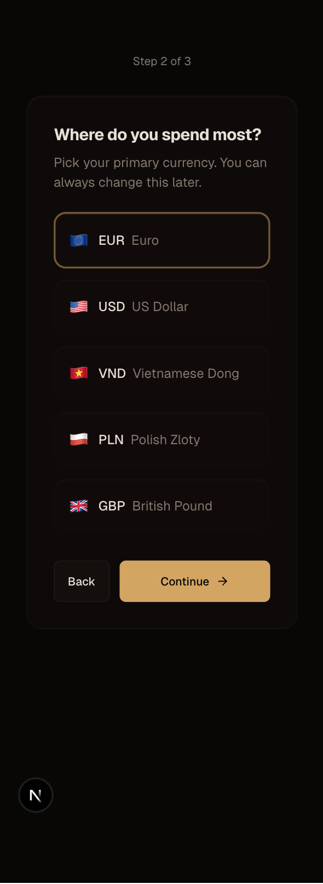
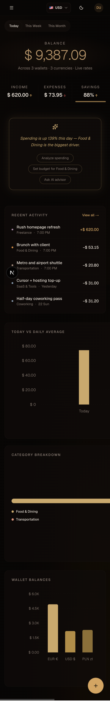

# Finance Project


Personal finance platform for multi-currency tracking, dashboards, and AI-powered insights.

Live demo: [finance-project-ecru.vercel.app](https://finance-project-ecru.vercel.app)

## Screenshots

<div align="center">
  
  
  
  
</div>

## Tech Stack

| Layer | Tech |
|-------|------|
| Framework | Next.js 16 (App Router, Server Actions, React 19) |
| Styling | Tailwind CSS 4 + shadcn/ui + Radix primitives |
| State | TanStack Query v5 |
| Database | Supabase (PostgreSQL + Row Level Security) |
| Auth | Supabase Auth (SSR-compatible) |
| AI | Vercel AI SDK + Groq (Llama 3.3 70B) |
| Charts | Recharts (Area, Pie, Bar) |
| Forms | react-hook-form + Zod v4 |
| Animations | prefers-reduced-motion respected globally |

## Quick start (NomadFinance AI)

```bash
cd nomad-finance-ai
npm install
# Add .env.local (Supabase + optional Groq), run schema in Supabase
npm run dev
```

Open [http://localhost:3000](http://localhost:3000). Use **Try Demo** on the login page to explore without signing up.
