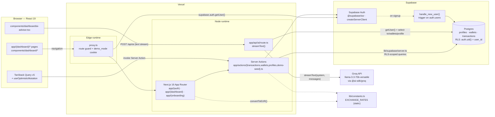

# NomadFinance AI

**Multi-currency finance platform built for digital nomads.** Track expenses across currencies, visualize spending patterns, and get AI-powered financial advice — all in one place.

## The Problem

Digital nomads earn in one currency, spend in three others, and have zero tools designed for their lifestyle. Generic finance apps assume a single currency, a single tax jurisdiction, and a stable address. None of that applies when you're bouncing between Lisbon, Ho Chi Minh City, and Krakow.

## The Solution

NomadFinance AI handles the complexity nomads actually face:

- **Multi-currency wallets** with real-time EUR-equivalent conversion (EUR, USD, VND, GBP, PLN)
- **Smart categorization** across nomad-relevant categories (coworking, flights, health insurance, SaaS tools)
- **AI financial advisor** that analyzes your actual transaction data and gives actionable advice on spending, savings, and EU tax implications
- **Demo mode** — recruiters can explore the full app without signing up

## Technical Decisions (and why)

### TanStack Query + useOptimistic for mutations

I chose TanStack Query v5 over SWR for its superior optimistic mutation API. Transactions use this pattern:

1. `useOptimistic` (React 19) updates the UI instantly
2. TanStack mutation fires the Server Action
3. On success: `invalidateQueries` syncs with the server
4. On error: rollback to previous state + toast notification

This creates a sub-100ms perceived response time while maintaining data consistency.

### Supabase RLS over proxy-based auth

Row Level Security means the database itself enforces data isolation. Auth redirects and session checks run in `proxy.ts` (Next.js 16 proxy convention; formerly middleware). Even if a Server Action has a bug, one user can never see another's data. This is security-by-default rather than security-by-convention.

### AI route

The `/api/ai` route uses Groq (Llama 3.3 70B) for streaming. Groq's inference speed plus a Node runtime gives streaming responses that start quickly. The system prompt is dynamically injected with the user's actual financial data — not generic advice.

### Server Actions over API routes for CRUD

Transactions and wallets use Next.js Server Actions instead of REST endpoints. This eliminates client-side serialization boilerplate, provides automatic TypeScript end-to-end type safety, and integrates cleanly with `revalidatePath` for cache invalidation.

## Architecture

### System overview

How the Next.js app, Supabase, and Groq fit together at runtime. Vercel hosts both the Edge `proxy.ts` (auth/redirect guard) and the Node-runtime app (Server Components, Server Actions, the `/api/ai` streaming route).



> **Not wired in:** there is no FX API (e.g. Frankfurter) — `EXCHANGE_RATES` in `lib/constants.ts` are static. Transactions can be created manually through `add-transaction-sheet.tsx` or imported from CSV through the flow below.

### CSV import flow

The dashboard import button opens `components/import/import-modal.tsx`, which parses CSV files in the browser, asks Groq for batched category suggestions, lets the user review low-confidence rows, and inserts with `external_id` duplicate protection.

```mermaid
graph LR
  FileDropzone["components/import/file-dropzone.tsx<br/>CSV file input"]
  PapaParse["papaparse<br/>client-side parsing"]
  DetectFormat["lib/csv/detect-format.ts<br/>detectFormat(headers)"]
  Parser["lib/csv/parsers/{revolut,wise,generic}.ts<br/>ParsedTransaction[]"]
  CategorizeRoute["app/api/categorize/route.ts<br/>generateObject() + Groq"]
  PreviewTable["components/import/import-preview-table.tsx<br/>review + category Select"]
  ImportAction["app/actions/import-transactions.ts<br/>generateExternalId() + upsert"]
  SupabaseDB[("Supabase transactions<br/>external_id dedupe")]

  FileDropzone --> PapaParse
  PapaParse --> DetectFormat
  DetectFormat --> Parser
  Parser --> CategorizeRoute
  CategorizeRoute -->|"llama-3.3-70b-versatile"| GroqImport["Groq API<br/>@ai-sdk/groq"]
  CategorizeRoute --> PreviewTable
  PreviewTable -->|"Confirm import"| ImportAction
  ImportAction -->|"lib/csv/dedupe.ts<br/>SHA-256 external_id"| SupabaseDB
```



### Route layout

```
Next.js App Router
├── (auth)/           Login, Register (Supabase Auth)
├── (dashboard)/      Protected routes
│   ├── dashboard/    Summary cards + 3 Recharts visualizations
│   ├── transactions/ Filterable CRUD table + optimistic updates
│   ├── wallets/      Multi-currency wallet overview
│   └── ai-advisor/   Streaming AI chat (Groq + Vercel AI SDK)
├── api/ai/           Streaming AI chat endpoint (Groq + Vercel AI SDK)
├── api/categorize/   Batched CSV transaction categorization endpoint
└── actions/          Server Actions for transactions + wallets
```

## Stack

| Layer | Tech |
|-------|------|
| Framework | Next.js 16 (App Router, Server Actions, React 19) |
| Styling | Tailwind CSS 4 + shadcn/ui + Radix primitives |
| State | TanStack Query v5 |
| Database | Supabase (PostgreSQL + Row Level Security) |
| Auth | Supabase Auth (SSR-compatible) |
| AI | Vercel AI SDK + Groq (Llama 3.3 70B) |
| Charts | Recharts (Area, Pie, Bar) |
| Forms | react-hook-form + Zod v4 |
| Animations | prefers-reduced-motion respected globally |

## Deployment

**Production is built from the `main` branch.** Feature branches (e.g. `feat/...`) may be deployed for previews, but final changes should be merged into `main` for release. CI runs on push/PR to `main` (lint, tests, build).

## Setup

### Prerequisites

- Node.js 18+
- A [Supabase](https://supabase.com) project
- (Optional) A [Groq](https://groq.com) API key for AI features

### 1. Clone and install

```bash
git clone <repo-url>
cd nomad-finance-ai
npm install
```

### 2. Environment variables

Create `.env.local`:

```env
NEXT_PUBLIC_SUPABASE_URL=your_supabase_url
NEXT_PUBLIC_SUPABASE_ANON_KEY=your_supabase_anon_key
GROQ_API_KEY=your_groq_api_key  # optional — AI advisor won't work without it
```

### 3. Database setup

Run `supabase/schema.sql` in your Supabase SQL Editor to create tables, RLS policies, and the auto-profile trigger.

For demo mode, create a user with email `demo@nomadfinance.app` / password `demo123456`, then run `supabase/seed.sql` (replace `DEMO_USER_ID` with the actual UUID).

### 4. Run

```bash
npm run dev
```

Open [http://localhost:3000](http://localhost:3000).

## Demo Mode

Click **Try Demo** on the login page to explore with pre-seeded data:

- 3 wallets (EUR, USD, VND) with realistic balances
- 45+ transactions across 3 months with nomad-relevant categories
- Full AI advisor access (if GROQ_API_KEY is set)

## Design Decisions 2026

The UI follows a **premium dark fintech** aesthetic inspired by Arc, Wise, and Revolut — designed for digital nomads who want calm, glanceable financial data.

### Color System

All colors use **OKLCH** for perceptually uniform contrast. The palette centers on three semantic accents:

- **Cyan-400** — primary accent, income, savings, total balance
- **Emerald-400** — positive values, success states
- **Amber-500 / Orange-400** — expenses, warnings (evoking a "Saigon sunset" nomad warmth)

Background uses zinc-950 with a subtle navy-to-slate gradient and a warm amber radial glow at the bottom-right corner.

### Glassmorphism

All cards use a layered glass effect: `bg-zinc-900/75`, `backdrop-blur-2xl`, semi-transparent borders (`border-zinc-700/60`), and a subtle cyan shadow (`shadow-cyan-500/10`). A faint inset highlight at the top edge creates the "floating" depth illusion. On hover, the glow intensifies and the card scales to 1.02.

### Typography

Balance numbers use `text-5xl` to `text-7xl` with `font-semibold` and `-1.5px` letter-spacing for maximum scannability. Labels use `text-xs uppercase tracking-wider` in `text-zinc-400` for clear hierarchy. Geist Sans is the primary typeface.

### Micro-interactions

Framer Motion provides staggered entrance animations (`opacity: 0 → 1`, `y: 20 → 0`) and spring-based hover lifts on all cards. All animations respect `prefers-reduced-motion`.

### Charts

Recharts with SVG glow filters (`feGaussianBlur` + `feFlood`) and gradient fills. Direct hex colors for reliable SVG rendering. Custom glass tooltips with backdrop-blur match the card aesthetic.

### Accessibility

All text meets WCAG AA contrast ratios: white on zinc-950 (~15:1), zinc-400 on zinc-950 (~5.2:1), cyan-400 on zinc-950 (~7.8:1). Glass effects are scoped to dark mode only — light mode uses standard shadcn/ui styling.

## Trade-offs

- **Static exchange rates**: Rates are hardcoded in `lib/constants.ts` rather than fetched from an API. For a portfolio project this avoids API key management complexity; production would use a rates API.
- **No real-time sync**: TanStack Query polls on stale time rather than using Supabase Realtime subscriptions. Acceptable for single-user and keeps the client bundle smaller.
- **Geist Sans font**: Uses the Geist Sans typeface for a modern fintech feel with system font fallbacks for fast cold starts.
